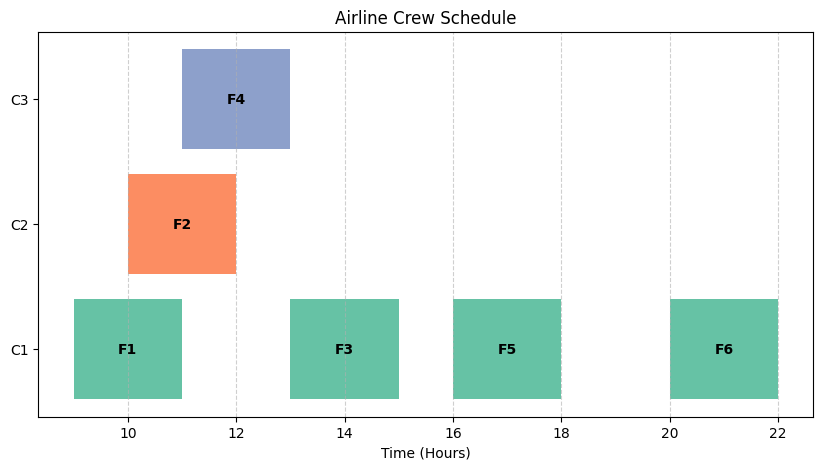
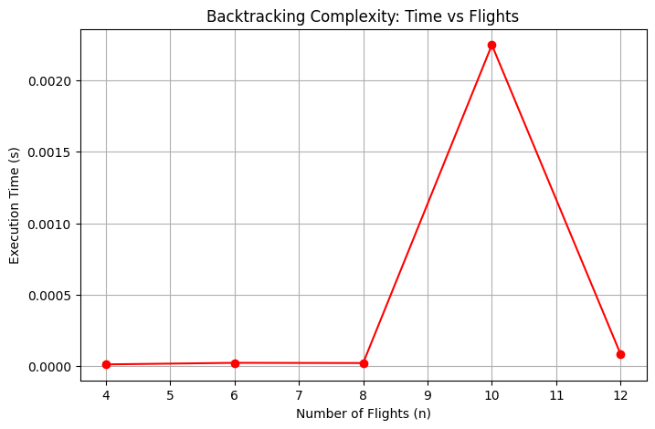

# ✈️ Airline Crew Scheduling – Backtracking & Constraint Satisfaction

A mini-project that models airline crew assignment as an NP-Hard scheduling problem, involving multiple operational constraints.
It demonstrates how Backtracking combined with Constraint Satisfaction can be used to explore feasible crew allocations.
This work is developed as part of the BCA (AI & DS) curriculum, emphasizing analytical and algorithmic thinking.

---

##  1. Problem Description

Airline crew scheduling requires assigning flights to crew members while ensuring operational constraints such as rest periods and non-overlapping timings. This project solves a simplified version of the problem using backtracking.

### **Given**

* A list of flights → `(Flight ID, Start Time, End Time)`
* A list of available crew members

### **Goal**

Assign flights to crew members such that:

✔ No overlapping flights
✔ Minimum rest time of **1 hour** between flights
✔ (Optional) Minimize cost or maximize fairness

---

##  2. Algorithmic Strategy

| Component           | Description                                                     |
| ------------------- | --------------------------------------------------------------- |
| **Method**          | Backtracking (Exhaustive Search)                                |
| **Domain**          | Airline Resource Allocation                                     |
| **Constraints**     | No overlap + mandatory rest time                                |
| **Time Complexity** | **O(k × 2ⁿ)** where *n = number of flights*, *k = crew members* |
| **NP-Hard?**        | Yes — structured like a constrained scheduling problem          |

---

##  3. Features Implemented

✔ Constraint checker (overlap + rest time)
✔ Generates all valid assignments
✔ Recursive backtracking solution
✔ Time profiling for different input sizes
✔ Count of recursive calls
✔ Gantt chart visualization (optional)
✔ Execution-time vs number of flights plot

---

##  4. Setup Instructions

Install required libraries:

```bash
pip install matplotlib memory_profiler
```

Run the Jupyter Notebook:

```
crew_scheduling_notebook.ipynb
```

---

##  5. Sample Output Format

Example mapping of crew members to assigned flights:

```json
{
C1: [('F1', 9, 11), ('F3', 13, 15), ('F5', 16, 18), ('F6', 20, 22)]
C2: [('F2', 10, 12)]
C3: [('F4', 11, 13)]
}
```
## Plots Generated

### Crew Scheduling Gantt Chart
  

### Backtracking Time Complexity Growth
  

---

##  6. Insights & Conclusion

### **Strengths**

* Simple and easy to implement
* Always finds the correct valid solution
* Great for learning constraint satisfaction

### **Limitations**

* Exponential time complexity
* Very slow when flights exceed **10–12**
* Not practical for real airline datasets

### **Real-World Improvements**

* Heuristics (MRV, degree heuristic, forward checking)
* Mixed-Integer Programming (MIP)
* Google OR-Tools
* Constraint solvers (Z3, PuLP)

---

##  7. Repository Structure

```
airline-crew-scheduling-aaradhya/
│── README.md
│── requirements.txt
│── crew_scheduling_notebook.ipynb
```

---

#  **8. Analysis Section (For Your Notebook Submission)**

## **Why Airline Crew Scheduling is NP-Hard?**

Because each flight can be assigned in multiple ways, and constraints increase combinations exponentially.

For **n flights**, the possible subsets are:
**2ⁿ**

With **k crew members**, the total search space becomes:

```
O(k × 2ⁿ)
```

This exponential growth makes the problem **NP-hard**, similar to:

* Job scheduling
* Timetable generation
* Vehicle routing problems

---

## **Why Backtracking Works Only for Small Inputs?**

Backtracking explores *every valid combination*.
Even a small increase in flights (like 8 → 12) causes:

* Huge increase in recursion calls
* Memory jumps
* Execution time becomes very slow

Backtracking is feasible only for:

* Classroom problems
* Academic demonstrations
* Small datasets (<12 flights)

---

## **Where Backtracking Fails?**

When **n > 12 flights**:

* Millions of recursion calls
* Execution time grows drastically
* Memory usage increases
* System becomes slow or unresponsive

This demonstrates why airlines cannot use brute force and rely on **optimization algorithms instead**.

---

##  9. Files Included

* **airline_crew_scheduling_Rohit_Main** — full code + plots
* **README.md** — project explanation
* **images/** — optional charts
* **requirements.txt** — dependencies

---
 Project Summary

| Element | Description |
| :--- | :--- |
| **Problem** | Airline Crew Scheduling |
| **Strategy** | Backtracking (Constraint Satisfaction) |
| **Time Complexity** | O(k × 2ⁿ) where n=flights, k=crew |
| **Domain** | Resource Allocation in Aviation |
| **Notes** | Infeasible for large datasets; requires optimization techniques |
